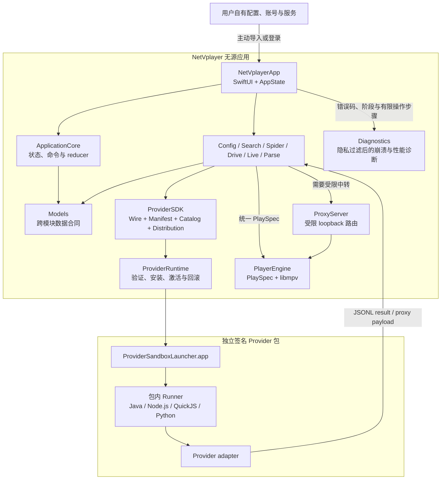
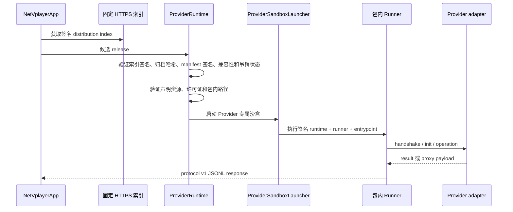
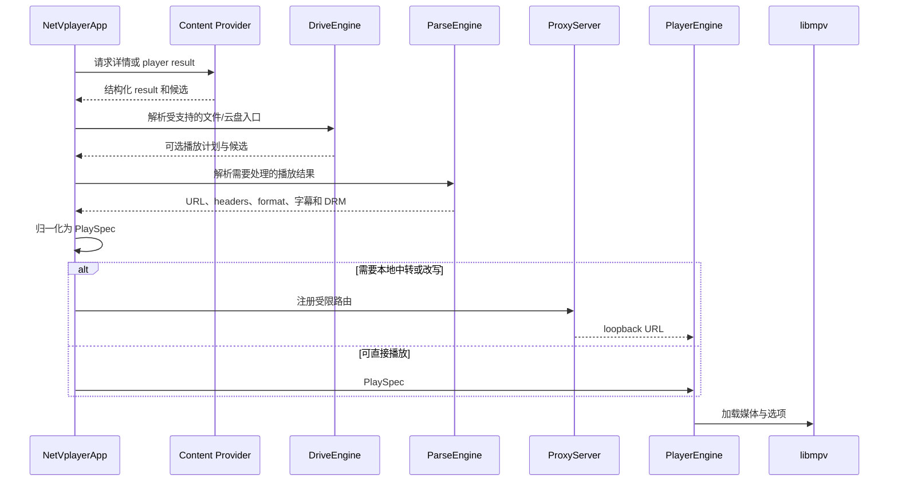

# NetVplayer Architecture

[中文](#中文) | [English](#english) | [Provider SDK](provider-sdk/README.md)

> [!IMPORTANT]
> The official public source and release application are source-free. They contain no video catalog, live channel list, default source address, site-specific Provider, account, credential, or media payload. Every content entry point is supplied explicitly by the user.

## 中文

### 系统边界

NetVplayer 将应用决策、平台能力、扩展执行和媒体播放分成独立层。公开应用负责配置解释、状态管理、安全检查和播放；用户负责提供自己有权访问的配置、服务和账号。

### 模块职责

| 层 | 模块 | 职责 |
| --- | --- | --- |
| 模型与决策 | `Models`, `ApplicationCore` | 定义配置、目录、搜索、直播、播放、历史和错误模型；执行不依赖平台副作用的状态转换 |
| 基础设施 | `Networking`, `Storage` | 受控 HTTP、URL 归一化、本地持久化、缓存、偏好和可移植备份 |
| 内容入口 | `ConfigEngine`, `SpiderEngine`, `DriveEngine` | 解释用户配置、选择内容适配器、处理受支持的文件与云盘入口 |
| 聚合与解析 | `SearchEngine`, `LiveEngine`, `ParseEngine` | 渐进搜索、直播列表/节目单解析、播放候选解析和错误归因 |
| 扩展合同 | `ProviderSDK` | 定义 protocol v1、manifest、source binding、catalog、distribution 和诊断格式 |
| 扩展执行 | `ProviderRuntime`, `QuickJSRuntime` | 验证签名包、管理安装/回滚、启动沙盒 Runner、提供受控 QuickJS host capability |
| 本地数据面 | `ProxyServer` | 提供受限本地代理、流式 Range、解析页、注册文件、缓存和健康路由 |
| 播放 | `PlayerEngine`, `MPVShim` | 将 `PlaySpec` 交给 libmpv，管理视频表面、播放状态、错误和会话生命周期 |
| 诊断 | `Diagnostics` | 将允许的错误码、阶段、版本和有限操作步骤投影到 Sentry；拒绝凭据、内容名、媒体地址和完整日志 |
| 辅助体验 | `DanmakuEngine`, `WebHomeEngine` | 提供默认关闭的弹幕与受限 WebHome 能力 |
| 应用组合 | `NetVplayerApp` | SwiftUI 界面、AppState、窗口、设置、命令执行、统一用户错误映射和所有用户可见入口 |

Swift Package 的产品和 target 关系以 [`NetVplayer/Package.swift`](NetVplayer/Package.swift) 为准。

### 配置与内容数据流

1. 用户主动添加兼容配置、文件服务或受支持账号。
2. `ConfigEngine` 拉取并解析配置，保留站点、直播、解析器和请求策略等结构。
3. `SpiderEngine` 根据站点类型和精确 binding 选择原生适配器、公开协议适配器或已验证 Provider。
4. `SearchEngine`、`LiveEngine` 和内容提供器把结果转换为 `Models` 中的稳定类型。
5. 未支持的平台依赖返回明确的兼容性错误，不伪装为可用能力；普通界面通过场景映射显示问题和建议动作，底层类型名只进入日志或高级诊断。

公开应用不会自动插入默认站点、直播列表或隐藏内容入口。Provider 只有在用户配置与签名 manifest 的 `source_bindings` 精确匹配后才会参与处理。

启动时先从 `active-version` 恢复并验签本机 Provider，再对照首次安装完成记录和当时的已安装组件清单。没有有效完成记录时，用户保存或新填写的点播源须等待签名目录同步与首次安装成功；失败进入重试状态。已有有效组件时，配置解析与首页加载只等待本地注册，在线检查和升级在后台进行。已识别但未完成的升级版本单独持久化，不覆盖仍可用的 active version；本地组件丢失或验签失败才触发修复门控。

首页在构造 `AppState` 时同步读取保存的点播配置是否存在：没有配置才显示添加入口，已有配置从首帧显示准备或加载状态。扩展支持页分别呈现构建未配置、首次安装未完成、本地包失效、更新检查失败和待升级，不以在线检查结果推断本地播放能力。

### Provider 信任边界

信任边界包含以下约束：

- 应用只接受固定 HTTPS 索引中的已签名 release。
- manifest、distribution index 和归档哈希分别验证。
- runtime、Runner、Provider、依赖和许可证必须全部位于签名包内并逐项声明。
- 每个 Provider 使用独立状态目录和 App Sandbox launcher。
- QuickJS 只能调用 manifest 声明的 host capabilities。
- `source_bindings` 使用精确匹配，不解释通配模式。
- 自动安装和手动重试只激活 `source_policy=user-configured-only` 的 Provider。
- 开发者自行生成的密钥不受官方应用信任。

### 播放数据流

`PlaySpec` 是播放器的唯一输入边界。它携带规范化 URL、请求头、格式、字幕、DRM、音频封面和必要的内存态播放计划。播放器不直接解释外部配置或 Provider manifest。

Provider 的 player result 也可以返回受限的 `PlaybackInteraction`。当前 `manual_verification` 只携带经过公开 HTTP(S) 目标校验的验证页、交互类型和用户消息，不携带媒体 URL；`SiteApi` 将其转换为类型化中断，`AppState` 显示用户驱动的 WebView，收到源站成功回调后重新请求原集数。该状态不会进入 `PlaySpec`，也不会由播放器或自动化绕过。

交互结果必须能改变同一 Provider 的后续请求。海绵保留 AES catalog 接口提供 6 个业务分类、筛选、首页和搜索；详情阶段用“精确标题 + 海报文件名”把 catalog 的不透明 ID 映射到 DESede 无验证码播放库，因为两套服务会把相同数字 ID 分配给不同影片。player 使用 `/api/user/init -> /api/vod/play_url`，把上游原始域替换为已验证的播放域，再由 `hmys-hls-v1` 为主清单和子资源动态签名。发布验收要求 HLS 总时长超过 120 秒，从合同层拒绝 11 秒升级提示片。该描述符仍只在海绵 API 绑定上获准本地化，避免把聚合包权限扩大到其它站点。

标准 HLS/MP4 在不需要改写时直接交给 libmpv。Spider callback、清单改写、注册文件、远端 Range 流或其它明确需要中转的输入才进入 `ProxyServer`。

### 本地代理路由

`ProxyServer` 只绑定 loopback，并对远端目标执行访问策略检查。主要路由为：

| 路由 | 合同 |
| --- | --- |
| `/proxy` | 处理 Provider proxy payload 或受控远端请求，清理 hop-by-hop 和重复长度/类型响应头 |
| `/stream` | 为已注册远端文件提供 Range、缓存、增量转发、生命周期和资源上限 |
| `/parse` | 提供本地解析页面，由应用显式传入目标和解析器 |
| `/file` | 只读取应用已注册的本地文件 ID，支持 Range、ETag 和条件请求 |
| `/cache` | 读写进程内受限缓存 |
| `/health` | 返回脱敏运行状态、活跃流、缓存和最近错误 |
| `/webResource` | 为 WebHome 提供受限 HTTP(S) 资源访问、Range、CORS 和必要请求头 |

目标校验拒绝本地文件、localhost、内网、link-local 和 multicast 远端地址。大型媒体使用流式路径；有界 buffered 路径用于清单和控制响应。

### 状态、凭据与隐私

- 配置、账号和访问凭据由用户提供，不属于应用发布内容。
- Provider 接收用户选择的站点上下文和不透明 `credential_ref`，不直接读取其它 Provider 状态或应用 Keychain 明文。
- 播放历史保存稳定内容身份，不持久化短效媒体 URL、Cookie 或 Authorization。
- 诊断输出会脱敏 URL 和敏感请求头；公开 issue 只应包含最小复现信息。
- 普通错误提示不直接透传底层 `localizedDescription`。`UserFacingErrorPresenter` 负责配置、来源、播放、直播、授权、存储、扩展、更新、反馈和页面场景，内部错误继续供本地日志与隐私过滤后的远端诊断使用。
- Provider 进程退出、超时或验证失败不会覆盖最后一个可用的已验证版本。

### 扩展开发

第三方 Provider 使用 JSON Schema 和语言 Runner 实现，不需要链接应用 UI 或播放器模块。接口、快速入门、manifest、打包和发行要求见 [Provider SDK 指南](provider-sdk/README.md)；各运行时的进程约束见 [Provider Runners](provider-runners/README.md)。

## English

### System boundary

NetVplayer separates application decisions, platform capabilities, extension execution, and media playback. The public application interprets user configuration, manages state, enforces trust checks, and plays media. Users supply and remain responsible for every configuration, service, account, and access right.

The diagram in the Chinese section defines the same boundary in full. The main layers are:

| Layer | Modules | Responsibility |
| --- | --- | --- |
| Models and decisions | `Models`, `ApplicationCore` | Stable data contracts and state transitions without platform side effects |
| Infrastructure | `Networking`, `Storage` | Controlled HTTP, URL normalization, local persistence, cache, preferences, and portable backup |
| Content entry | `ConfigEngine`, `SpiderEngine`, `DriveEngine` | Interpret user configuration and select supported content/file/cloud adapters |
| Aggregation and parsing | `SearchEngine`, `LiveEngine`, `ParseEngine` | Progressive search, live/EPG parsing, playback resolution, and error attribution |
| Extension contract | `ProviderSDK` | Protocol v1, manifest, source binding, catalog, distribution, and diagnostics |
| Extension execution | `ProviderRuntime`, `QuickJSRuntime` | Verify, install, activate, roll back, and run sandboxed Providers |
| Local data plane | `ProxyServer` | Restricted loopback proxy, Range streaming, parser page, registered files, cache, and health routes |
| Playback | `PlayerEngine`, `MPVShim` | `PlaySpec`, libmpv integration, video surface, playback state, errors, and session lifecycle |
| Diagnostics | `Diagnostics` | Privacy-filtered crash and performance reporting with fixed error codes, stages, versions, and bounded interaction steps |
| Application composition | `NetVplayerApp` | SwiftUI, AppState, windows, settings, command execution, user-facing error translation, and visible entry points |

The package products and target dependencies are defined by [`NetVplayer/Package.swift`](NetVplayer/Package.swift).

### Configuration and content flow

The user explicitly adds a compatible configuration, file service, or supported account. `ConfigEngine` parses it, and `SpiderEngine` selects an adapter or a verified Provider from the exact site identity. Search, live, and content modules convert results into stable `Models` types. Unsupported platform dependencies return an explicit compatibility error, and the application maps that internal failure to a plain-language problem and next action before rendering it.

The public application never inserts a default site, live list, or hidden content entry point. A Provider participates only when user configuration exactly matches its signed `source_bindings`.

At startup, active local Provider versions are restored and verified before comparing them with the recorded initial-install completion and installed-package snapshot. Without a valid completion record, a saved or newly entered VOD source waits for the first signed-catalog installation; failure offers retry. With valid local packages, configuration and home loading wait only for local registration while online update checks continue independently. Pending upgrade versions are persisted separately from the active version; a missing or invalid local package triggers repair.

`AppState` reads whether a VOD configuration was saved before the first home-screen render. Only a truly unconfigured install shows the add-source prompt; a saved source shows preparation or loading immediately. Extension Settings distinguishes an unconfigured build, incomplete first install, invalid local package, failed update check, and pending upgrade without treating online status as a playback-health test.

### Provider trust boundary

`ProviderRuntime` accepts releases only from the pinned HTTPS distribution index. It verifies the index signature, archive SHA-256, manifest signature, shell/macOS/architecture compatibility, declared assets, license payload, sandbox launcher, and revocation state before activation.

The sandbox launches only the package-local runtime, Runner, and Provider entrypoint. QuickJS receives only declared host capabilities. Provider state is isolated by Provider ID. Automatic installation and manual retry activate only packages with `source_policy=user-configured-only`. A locally generated development key is never trusted by the official application.

### Playback flow

Content results, drive plans, parser output, headers, subtitles, DRM, and format metadata are normalized into `PlaySpec`. `PlayerEngine` accepts that single input contract and passes it to libmpv.

A Provider player result may instead request a bounded `PlaybackInteraction`. The current `manual_verification` form carries only a validated public HTTP(S) verification page, an interaction kind, and a user-facing message; it exposes no media URL. `SiteApi` raises a typed interruption, `AppState` presents a user-driven WebView, and the selected episode is requested again only after the upstream success callback. This state never becomes a `PlaySpec` and automation does not bypass it.

An interaction result must change a later request in the same Provider session. Hmys keeps the AES catalog API for six business categories, filters, home, and search. At detail time, an opaque catalog ID is mapped to the no-challenge DESede playback catalog by exact title and poster filename because the services reuse numeric IDs for different titles. Playback then uses `/api/user/init -> /api/vod/play_url`, replaces the advisory origin with the verified playback host, and lets `hmys-hls-v1` refresh signatures for manifests and child resources. Release verification requires more than 120 seconds of HLS media. The descriptor remains restricted to Hmys API bindings.

Direct HLS/MP4 bypasses the local proxy when no rewrite or mediation is required. Spider callbacks, playlist rewriting, registered files, remote Range streams, and other explicitly mediated inputs use `ProxyServer`. The server binds only to loopback and rejects local-file, localhost, private-network, link-local, and multicast remote targets.

### State and privacy

- User configurations, accounts, and credentials are not release payloads.
- Providers receive selected site context and opaque credential references, not another Provider's state or raw application Keychain values.
- Playback history stores stable content identity instead of short-lived media URLs or sensitive headers.
- Diagnostics redact URLs and sensitive headers.
- Ordinary UI errors never expose raw Android compatibility names, Provider/runtime types, player internals, or unfiltered `localizedDescription`; those details remain in local or privacy-filtered diagnostics.
- Failed verification, launch, or update leaves the last active verified Provider version available.

### Extension development

Third-party Providers use the JSON Schemas and language Runners without linking the application UI or player modules. See the [Provider SDK guide](provider-sdk/README.md) for the interface, quick start, manifest, packaging, and distribution requirements, and [Provider Runners](provider-runners/README.md) for runtime process constraints.
