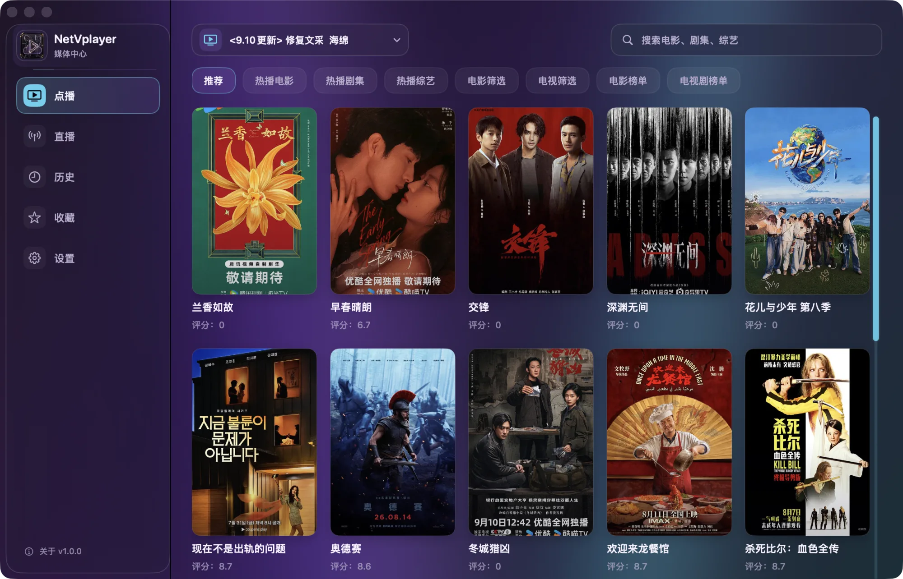
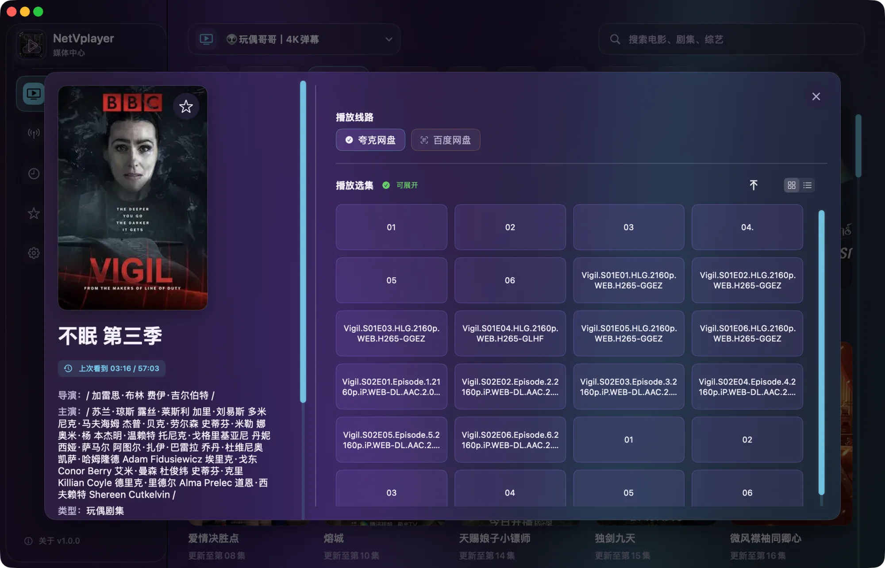
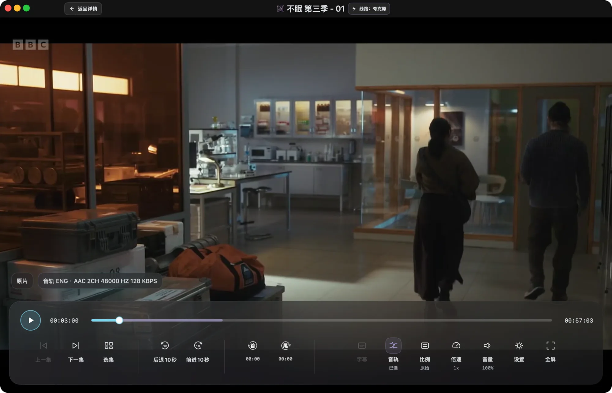
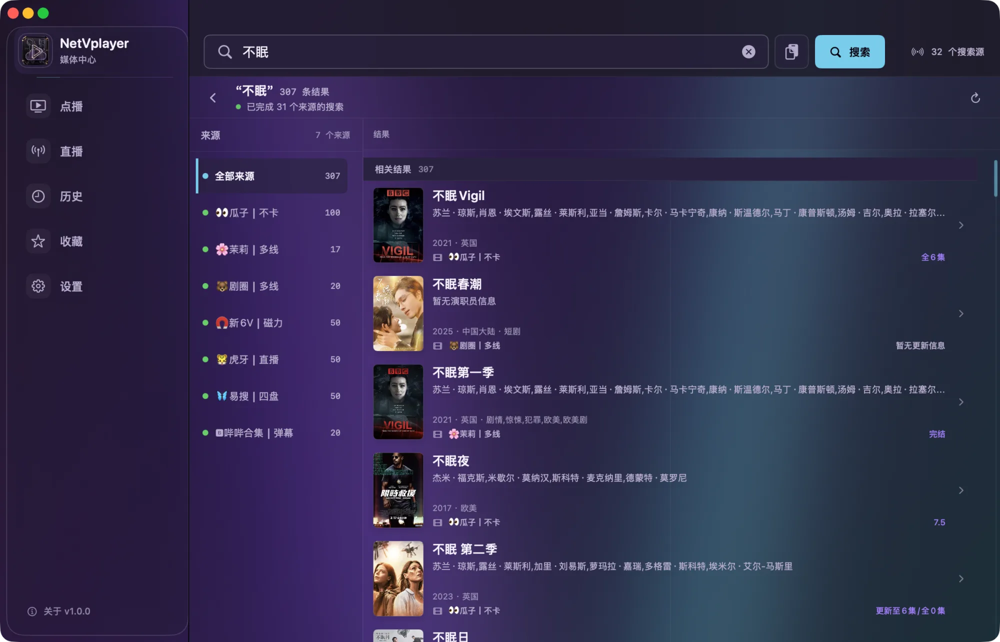
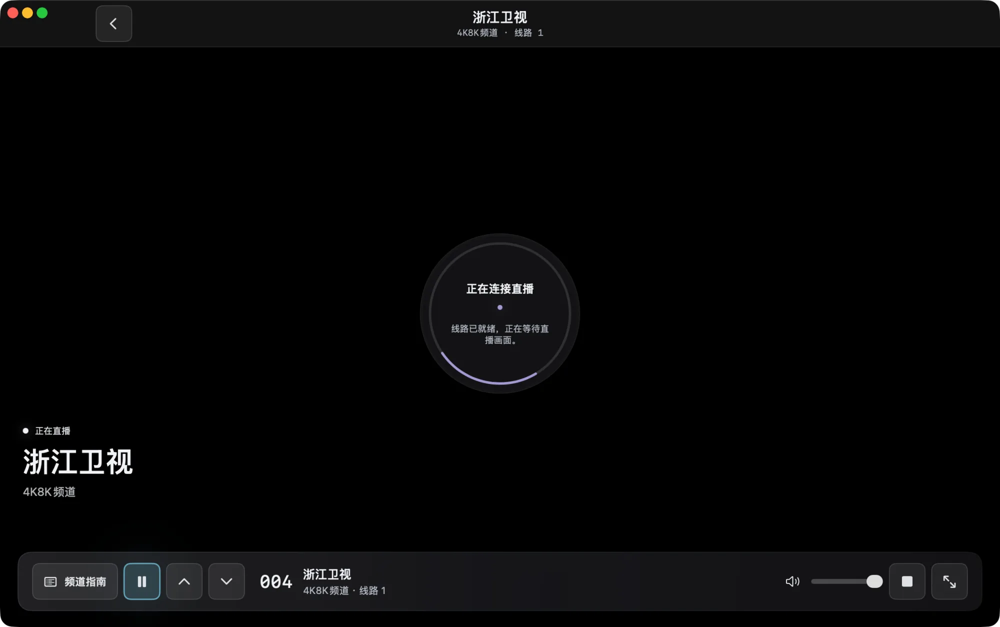
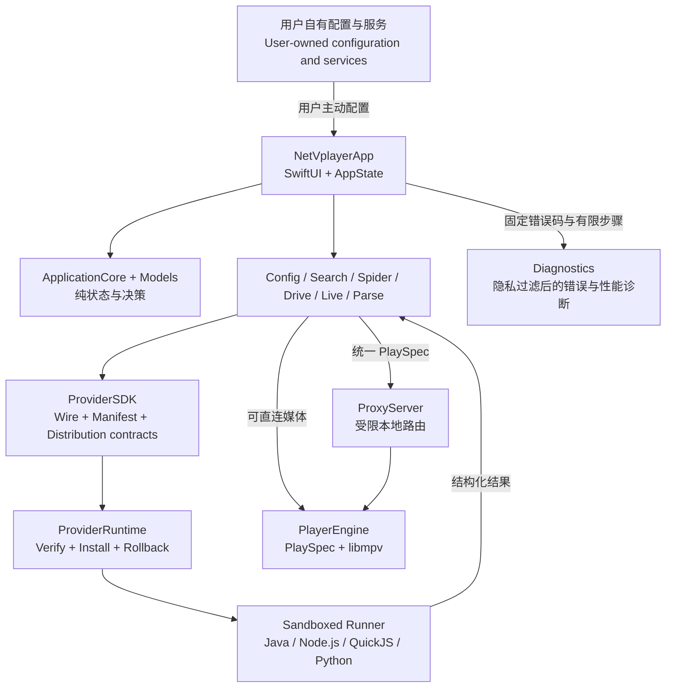
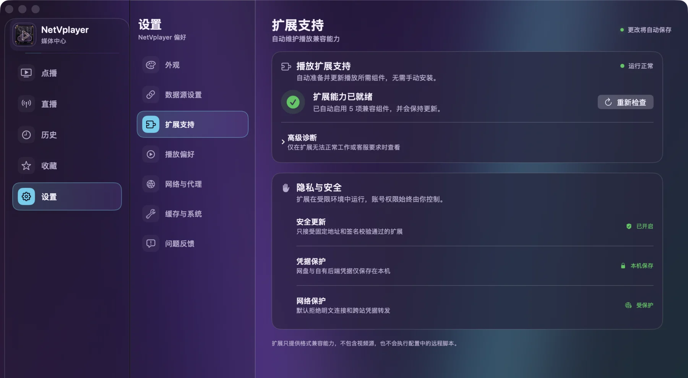

# NetVplayer

<p align="center">
  
</p>

<p align="center">
  <strong>你的内容，你的 Mac，你的播放方式。</strong><br>
  <strong>Your content. Your Mac. Your way to watch.</strong>
</p>

<p align="center">
  <a href="#中文">中文</a> |
  <a href="#english">English</a> |
  <a href="https://spudhero.github.io/NetVplayer/">Website</a> |
  <a href="https://github.com/spudhero/NetVplayer/releases/latest">Download</a> |
  <a href="CHANGELOG.md">Release History</a> |
  <a href="provider-sdk/README.md">Provider SDK</a>
</p>



> [!IMPORTANT]
> NetVplayer 的官方公开源码与发布应用不提供、托管或内置任何视频源、视频目录、直播列表、默认源地址、站点 Provider、账号或媒体内容。用户只能连接自己选择且有权访问的内容。
>
> The official public source and release build do not provide, host, or bundle video sources, catalogs, live channel lists, default source URLs, site-specific Providers, accounts, or media. Users may connect only content they choose and are authorized to access.

---

## 中文

### 原生 macOS 媒体播放器

NetVplayer 1.0.10 是基于 SwiftUI 与内嵌 `libmpv` 构建的原生 macOS 媒体播放器。它把内容发现、详情与选集、跨来源搜索、点播、直播、字幕、音轨和播放历史组织成一致的桌面体验，同时让内容入口和访问凭据始终由用户掌控。

### 项目背景

FongMi/TV、OK影视、影视仓、TVBox 等常用工具主要服务 Android 生态。我一直没有找到符合自己使用习惯的 macOS 版本，于是从 SwiftUI 与 libmpv 开始，写了 NetVplayer。

NetVplayer 的目标不是照搬手机或电视端界面，而是把内容浏览、搜索、选集、点播和直播重新组织成一套原生 Mac 桌面体验。NetVplayer 不是上述项目的官方 Mac 版，与它们不存在隶属或官方合作关系；项目感谢 FongMi/TV 等开源实践提供的兼容性参考，并保持独立的 Swift/macOS 实现。

[查看版本与修复历史](CHANGELOG.md#中文)。README 只保留当前产品能力、安装方法和稳定使用说明。

你可以添加自己的兼容配置、WebDAV、AList/OpenList 或受支持的云盘账号。全新安装保持空白，直到用户主动添加内容入口；已保存的配置可以在后续启动时恢复。

### 完整观看体验

| 发现与选集 | 点播播放 |
| :---: | :---: |
|  |  |
| **详情、线路与选集**<br>集中呈现影片信息、多线路和自然排序后的剧集。 | **原生播放控制**<br>使用 libmpv 播放，支持字幕、音轨、倍速、画面比例和紧凑窗口。 |

| 跨来源搜索 | 直播播放 |
| :---: | :---: |
|  |  |
| **高密度搜索工作台**<br>只搜索用户已经连接并选择的内容入口。 | **独立直播窗口**<br>提供频道分组、同名线路合并和按需显示的频道指南。 |

### 用户自有内容

NetVplayer 提供播放、连接和兼容能力，不运营内容服务，也不代替用户取得访问授权。

- 公开仓库和发布应用不包含视频目录、直播列表、默认配置或媒体文件。
- 配置地址、站点列表、账号和凭据由用户自行提供并保存在本地边界内。
- 用户应只访问自己有权使用的内容，并遵守所在地法律及相关服务条款。
- Provider 扩展只能在用户配置精确匹配后参与处理，不能静默增加内容入口。

### 安全扩展

Provider 是与主应用分离的扩展包。NetVplayer 只接受固定 HTTPS 索引中的候选，并在激活前检查索引签名、归档 SHA-256、manifest 签名、协议版本、App/macOS/架构兼容性、声明资源、沙盒启动器和吊销状态。

当前公开壳只会自动安装声明 `user-configured-only` 的 Provider。运行时、Runner、Provider 和依赖都必须位于签名包内；Runner 不会在运行时下载代码或安装依赖。其它用户配置策略需要单独的壳层与发行审查，不能借自动安装路径激活。

### 项目架构



`Models` 和 `ApplicationCore` 保存跨模块数据与纯决策；平台引擎负责配置、网络、Provider、网盘、解析和直播；所有播放入口最终归一化为 `PlaySpec`，再由 `PlayerEngine` 交给 libmpv。普通界面把内部失败转换为可理解的问题和建议动作，`Diagnostics` 只接收隐私门禁允许的固定错误码、阶段和有限步骤。详细模块边界、Provider 数据流和代理路由见[架构说明](ARCHITECTURE.md)。

### Provider SDK

仓库公开的 SDK 用于开发 **Provider 扩展**，不是把播放器嵌入其它应用的播放控件 SDK。它包括：

- `ProviderSDK` Swift 类型以及 protocol v1、manifest、catalog、source descriptor 和 distribution index JSON Schema；
- Java 21、Node.js 22.20.0、QuickJS 2026-06-04 和 Python Runner；
- fixture、签名打包、包结构验证、运行时验证和发行检查脚本。

从 [Provider SDK 开发指南](provider-sdk/README.md)开始，先运行不访问网络的 Python fixture，再选择目标运行时。Runner 的实现约束见 [Provider runners 参考](provider-runners/README.md)。

### 下载与构建

当前公开版本面向 macOS 14 或更高版本和 Apple Silicon。请从[项目官网](https://spudhero.github.io/NetVplayer/)或[最新 GitHub Release](https://github.com/spudhero/NetVplayer/releases/latest)下载。

应用会检查主程序更新，并在侧栏和设置页的版本号旁提示。打开版本号后可查看新版并选择“更新”；下载和验证在后台完成，正常退出应用后安装，下次启动使用新版本。1.0.8 及更早版本不含应用内更新器，需要先手动安装一次 1.0.9 或更新版本。当前 ad-hoc 签名仍可能触发 macOS 的首次打开或安装授权提示。

#### 小白安装步骤

1. 点击 macOS 左上角苹果菜单，打开“关于本机”，确认芯片是 Apple M 系列，系统为 macOS 14 或更高版本。当前公开版本暂不支持 Intel Mac。
2. 下载名称中包含 `macos-arm64.zip` 的最新正式安装包。
3. 双击 ZIP 解压，将 `NetVplayer.app` 拖入“应用程序”文件夹。
4. 首次启动时，在 Finder 中右键 NetVplayer 并选择“打开”，再在确认框中选择一次“打开”。
5. 如果仍被系统拦截，进入“系统设置 → 隐私与安全性”，确认应用名称后选择“仍要打开”。当前版本使用社区 ad-hoc 签名，首次放行通常只需一次。
6. 启动后等待“扩展支持”显示就绪。首次准备和后续更新扩展时，网络需要能够正常连接 GitHub；下载并验证完成后，离线时仍可继续使用本机已经安装且有效的组件。
7. 进入“设置 → 数据源设置”，填写你自己有权使用的兼容配置。看到加载成功后返回首页即可开始浏览和播放。



在“设置 → 扩展支持”看到“扩展能力已就绪”后，即可继续配置自己的内容入口。遇到异常时选择“重新检查”。

从源码构建需要 Xcode 和 Homebrew 提供的 libmpv 依赖：

```bash
swift build --package-path NetVplayer
swift test --package-path NetVplayer --disable-sandbox --no-parallel
```

生成隔离的无源发布应用：

```bash
bash NetVplayer/script/build_and_run.sh \
  --package-public /absolute/path/to/output
```

该命令会拒绝脏的公开检出和额外源码/资源输入，并检查运行库许可证、SBOM、签名和最终 `.app` 的无源边界。它不会替换或启动 `/Applications/NetVplayer.app`。

### 常见问题

- **支持 Intel Mac 吗？** 当前不支持。公开版本只提供 Apple Silicon arm64 构建。
- **为什么第一次打开会被 macOS 拦截？** 当前版本使用社区 ad-hoc 签名，没有使用 Apple Developer ID 公证。请确认应用名称和下载来源后完成首次放行。
- **软件自带视频源或直播列表吗？** 不自带。公开应用不内置、不提供也不托管视频源、直播列表、账号或媒体内容。
- **配置地址从哪里获得？** 请使用你自己维护、购买或明确获得授权的内容服务。项目不提供、推荐或代找视频源地址。
- **播放扩展需要手动安装吗？** 正常情况下不需要。首次准备或后续更新时，网络必须能连接 GitHub，否则下载与更新无法完成。已经安装并验证通过的组件在离线时仍可继续使用；状态异常时可在“设置 → 扩展支持”中选择“重新检查”。
- **配置和授权凭据保存在哪里？** 配置与授权凭据只保存在本机；非敏感备份不会包含云盘 Token、Cookie 等授权信息。
- **为什么错误提示不再显示 Android、Provider 或播放器内部名称？** 这些属于兼容和诊断实现，不是用户可执行的问题说明。普通界面会说明配置、来源、网络、授权或播放出了什么问题，并提示重试、切换来源/线路或重新授权；技术细节继续保留在脱敏诊断中。
- **这是 FongMi、影视仓或 TVBox 的官方 Mac 版吗？** 不是。NetVplayer 是独立的 Swift/macOS 实现，与这些项目不存在隶属或官方合作关系。
- **遇到问题如何反馈？** 使用应用内“问题反馈”生成脱敏信息并描述复现步骤。不要公开账号、Token、Cookie 或完整配置地址。
- **支持自动错误上报吗？** 配置了 Sentry 的构建可自动发送崩溃堆栈、版本、错误码和有限操作步骤，并对起播耗时进行 5% 采样。可在“设置 → 问题反馈 → 自动诊断”关闭；账号凭据、媒体名称、播放地址和完整日志不随自动诊断发送。未配置 Sentry 的构建不发送自动诊断。

### 仓库结构

| 路径 | 用途 |
| --- | --- |
| `NetVplayer/` | macOS 应用与 Swift Package 模块 |
| `provider-sdk/` | 公开 wire、manifest、catalog 和 distribution Schema 与开发指南 |
| `provider-runners/` | Java、Node.js、QuickJS 和 Python Runner 合同 |
| `script/` | 构建、签名、沙盒、边界审计与发行检查 |
| `website/` | 项目官网及真实产品截图 |

### 致谢

感谢 [FongMi/TV](https://github.com/FongMi/TV) 项目及其贡献者。FongMi 对 TVBox 配置、CatVod 生命周期、播放解析和本地代理行为的长期实践，为 NetVplayer 的兼容性研究和测试合同提供了重要参考。

NetVplayer 与 FongMi/TV 没有隶属或官方合作关系。NetVplayer 使用独立的 Swift/macOS 实现，官方公开源码与发布应用不包含 FongMi 的 GPL 源码、Android JAR/Dex/so 或其运行时。

### 参与项目

提交代码或诊断前请阅读 [CONTRIBUTING.md](CONTRIBUTING.md) 和 [SECURITY.md](SECURITY.md)。NetVplayer 使用 [MIT License](LICENSE) 发布；第三方组件继续适用各自的许可证和声明。

---

## English

### A native media player for macOS

NetVplayer 1.0.10 is a native macOS media player built with SwiftUI and an embedded `libmpv` playback core. It brings discovery, details and episodes, federated search, video on demand, live playback, subtitles, audio tracks, and viewing history into one desktop experience while keeping content entry points and access credentials under the user's control.

### Project background

FongMi/TV, OK影视, 影视仓, and TVBox primarily serve the Android ecosystem. I could not find a macOS version that matched how I wanted to use a desktop media app, so I started NetVplayer with SwiftUI and libmpv.

The goal is not to copy a phone or TV interface. NetVplayer reorganizes discovery, search, episode selection, on-demand playback, and live playback as a native Mac experience. It is not an official Mac edition of those projects and has no affiliation or official partnership with them. Their open-source work remains an important compatibility reference, while NetVplayer uses an independent Swift/macOS implementation.

[Read the release and fix history](CHANGELOG.md#english). The README stays focused on current capabilities, installation, and stable usage guidance.

You can add your own compatible configuration, WebDAV, AList/OpenList, or supported cloud-drive account. A fresh installation stays empty until the user adds an entry point. Saved configurations can be restored on later launches.

### The viewing experience

- **Details, routes, and episodes:** browse metadata, multiple playback routes, and naturally sorted episodes in one view.
- **Native playback controls:** use libmpv with subtitle, audio-track, speed, aspect-ratio, and compact-window controls.
- **Federated search:** search only across content entry points the user has already connected and selected.
- **Live playback:** use a dedicated player window with channel groups, same-channel route merging, and an on-demand channel guide.
- **Personal themes:** choose from the built-in appearance catalog without changing the underlying native interaction model.

The screenshots above come from the running application and are also used by the [project website](https://spudhero.github.io/NetVplayer/).

### User-owned content

NetVplayer supplies playback, connection, and compatibility capabilities. It does not operate a content service or obtain access rights for users.

- The public repository and release application contain no video catalogs, live channel lists, default configurations, or media files.
- Configuration URLs, site lists, accounts, and credentials are supplied by the user and remain within local application boundaries.
- Users must access only content they are authorized to use and comply with applicable law and service terms.
- Provider extensions participate only after an exact match against user-supplied configuration. They cannot silently add content entry points.

### Verified extensions

Providers are separate from the main application. NetVplayer considers releases only from its pinned HTTPS index, then verifies the index signature, archive SHA-256, manifest signature, protocol version, application/macOS/architecture compatibility, declared assets, sandbox launcher, and revocation state before activation.

The current public shell automatically installs only Providers that declare `user-configured-only`. The runtime, Runner, Provider, and dependencies must all live inside the signed package. Runners never download code or install dependencies at runtime. Any other user-configured policy requires separate shell and release review and cannot use the automatic activation path.

### Architecture

`Models` and `ApplicationCore` own cross-module data and pure decisions. Platform engines handle configuration, networking, Providers, cloud drives, parsing, and live playback. Every playback entry point is normalized into a `PlaySpec` before `PlayerEngine` sends it to libmpv. Ordinary UI maps internal failures to a plain-language problem and next action, while `Diagnostics` receives only fixed error codes, stages, and bounded interaction steps allowed by the privacy gate. The diagram in the Chinese section shows the complete boundary; see the [architecture guide](ARCHITECTURE.md) for module responsibilities, Provider data flow, and local proxy routes.

### Provider SDK

The public SDK is for building **Provider extensions**. It is not a player-control SDK for embedding NetVplayer in another application. It includes:

- Swift `ProviderSDK` types and JSON Schemas for protocol v1, manifests, catalogs, source descriptors, and distribution indexes;
- Runners for Java 21, Node.js 22.20.0, QuickJS 2026-06-04, and Python;
- fixtures and tools for signing, packaging, structural validation, runtime validation, and release checks.

Start with the [Provider SDK development guide](provider-sdk/README.md), which runs a network-free Python fixture before introducing runtime-specific packaging. See the [Provider runners reference](provider-runners/README.md) for implementation constraints.

### Download and build

The current 1.0.10 release targets macOS 14 or later on Apple Silicon. Download it from the [project website](https://spudhero.github.io/NetVplayer/) or the [latest GitHub Release](https://github.com/spudhero/NetVplayer/releases/latest).

The app checks for application updates and marks the version in the sidebar and Settings when a new release is available. Open the version, review the update, and select Update to download and verify it in the background. Installation happens when the app normally quits. Version 1.0.8 and earlier need one manual installation of 1.0.9 or later to gain in-app updates. The current ad-hoc signature may still require macOS first-open or installation approval.

#### Beginner installation

1. Open Apple menu → About This Mac. Confirm that the chip is an Apple M-series chip and that the system is macOS 14 or later. The current public build does not support Intel Macs.
2. Download the latest release file whose name contains `macos-arm64.zip`.
3. Double-click the ZIP and move `NetVplayer.app` into Applications.
4. On first launch, right-click NetVplayer in Finder, choose Open, and confirm Open once more.
5. If macOS still blocks the app, open System Settings → Privacy & Security, confirm the application name, and choose Open Anyway. The community ad-hoc build normally needs this approval only once.
6. Wait for Verified Extensions to become ready. The first preparation and later updates require a network connection that can reach GitHub. After the components are downloaded and verified, installed components that remain valid can continue to work offline.
7. Open Settings → Data Sources and load a compatible configuration that you are authorized to use.


Continue to your content configuration after this screen reports that extension support is ready. Use Check Again if the status reports a problem.

Building from source requires Xcode and the Homebrew libmpv dependencies:

```bash
swift build --package-path NetVplayer
swift test --package-path NetVplayer --disable-sandbox --no-parallel
```

Create an isolated source-free release bundle:

```bash
bash NetVplayer/script/build_and_run.sh \
  --package-public /absolute/path/to/output
```

The command rejects a dirty public checkout and unexpected source or resource inputs. It verifies runtime licenses, SBOM data, signatures, and the source-free boundary of the final `.app`. It does not replace or launch `/Applications/NetVplayer.app`.

### FAQ

- **Does it support Intel Macs?** Not currently. The public release is an Apple Silicon arm64 build.
- **Why can macOS block the first launch?** The current release uses community ad-hoc signing rather than Apple Developer ID notarization. Verify the application name and download source before approving the first launch.
- **Does the app include video sources or live channel lists?** No. The public app does not bundle, provide, or host catalogs, live lists, accounts, or media.
- **Where do configuration URLs come from?** Use only services that you maintain, purchase, or are explicitly authorized to access. The project does not provide or recommend source URLs.
- **Do I install Provider extensions manually?** Normally no. The initial preparation and later updates require network access to GitHub; without it, downloads and updates cannot complete. Components that are already installed and verified can continue to work offline. Use Settings → Verified Extensions → Check Again when the status reports a problem.
- **Where are configurations and credentials stored?** Configurations and authorization credentials remain on the Mac. Non-sensitive backups exclude cloud-drive tokens and cookies.
- **Why do errors no longer show Android, Provider, or player implementation names?** Those names describe compatibility internals rather than an action the user can take. Ordinary messages identify the configuration, source, network, authorization, or playback problem and suggest retrying, switching a source or route, or authorizing again. Technical details remain in redacted diagnostics.
- **Is this an official Mac version of FongMi, OK影视, 影视仓, or TVBox?** No. NetVplayer is an independent Swift/macOS implementation with no affiliation or official partnership.
- **How do I report a problem?** Use the in-app Problem Report flow to generate redacted diagnostics and describe the reproduction steps. Never publish accounts, tokens, cookies, or full configuration URLs.
- **Does the app report errors automatically?** Builds configured with Sentry can send crash stacks, app versions, error codes and a limited trail of diagnostic steps, with 5% sampling for playback startup timing. Disable this in Settings → Problem Report → Automatic Diagnostics. Credentials, media titles, playback URLs and full logs are excluded. Builds without a Sentry configuration do not send automatic diagnostics.

### Repository layout

| Path | Purpose |
| --- | --- |
| `NetVplayer/` | macOS application and Swift Package modules |
| `provider-sdk/` | Public wire, manifest, catalog, and distribution Schemas plus the development guide |
| `provider-runners/` | Java, Node.js, QuickJS, and Python Runner contracts |
| `script/` | Build, signing, sandbox, boundary-audit, and release checks |
| `website/` | Project website and real product screenshots |

### Acknowledgements

Thank you to the [FongMi/TV](https://github.com/FongMi/TV) project and its contributors. Its long-running work on TVBox configuration, the CatVod lifecycle, playback resolution, and local proxy behavior provided valuable references for NetVplayer's compatibility research and test contracts.

NetVplayer is not affiliated with or endorsed by FongMi/TV. NetVplayer uses an independent Swift/macOS implementation. The official public source and release application do not bundle FongMi GPL source, Android JAR/Dex/so artifacts, or its runtime.

### Contributing

Read [CONTRIBUTING.md](CONTRIBUTING.md) and [SECURITY.md](SECURITY.md) before submitting code or diagnostics. NetVplayer is released under the [MIT License](LICENSE). Third-party components retain their own licenses and notices.
