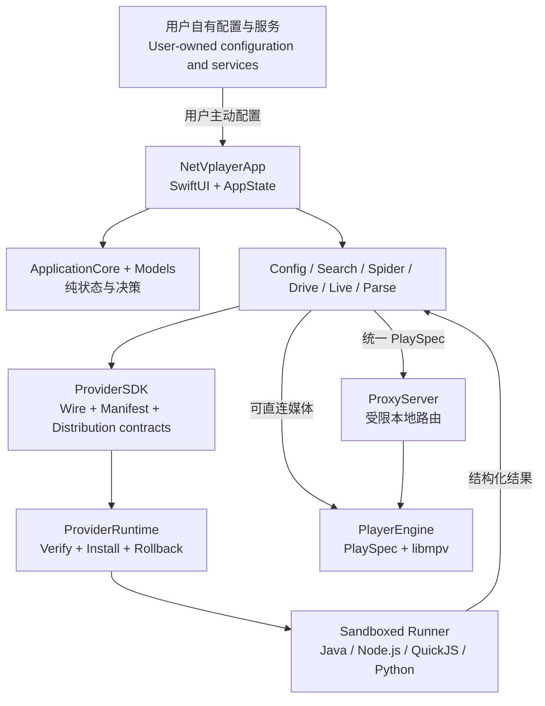

# NetVplayer

<p align="center">
  
</p>

<p align="center">
  <strong>你的内容，你的 Mac，你的播放方式。</strong><br>
  <strong>Your content. Your Mac. Your way to watch.</strong>
</p>

<p align="center">
  <a href="#中文">中文</a> |
  <a href="#english">English</a> |
  <a href="https://spudhero.github.io/NetVplayer/">Website</a> |
  <a href="https://github.com/spudhero/NetVplayer/releases/latest">Download</a> |
  <a href="provider-sdk/README.md">Provider SDK</a>
</p>


> [!IMPORTANT]
> NetVplayer 的官方公开源码与发布应用不提供、托管或内置任何视频源、视频目录、直播列表、默认源地址、站点 Provider、账号或媒体内容。用户只能连接自己选择且有权访问的内容。
>
> The official public source and release build do not provide, host, or bundle video sources, catalogs, live channel lists, default source URLs, site-specific Providers, accounts, or media. Users may connect only content they choose and are authorized to access.

---

## 中文

### 原生 macOS 媒体播放器

NetVplayer 是基于 SwiftUI 与内嵌 `libmpv` 构建的原生 macOS 媒体播放器。它把内容发现、详情与选集、跨来源搜索、点播、直播、字幕、音轨和播放历史组织成一致的桌面体验，同时让内容入口和访问凭据始终由用户掌控。

你可以添加自己的兼容配置、WebDAV、AList/OpenList 或受支持的云盘账号。全新安装保持空白，直到用户主动添加内容入口；已保存的配置可以在后续启动时恢复。

### 完整观看体验

| 发现与选集 | 点播播放 |
| :---: | :---: |
|  |  |
| **详情、线路与选集**<br>集中呈现影片信息、多线路和自然排序后的剧集。 | **原生播放控制**<br>使用 libmpv 播放，支持字幕、音轨、倍速、画面比例和紧凑窗口。 |

| 跨来源搜索 | 直播播放 |
| :---: | :---: |
|  |  |
| **高密度搜索工作台**<br>只搜索用户已经连接并选择的内容入口。 | **独立直播窗口**<br>提供频道分组、线路切换和按需显示的频道指南。 |

### 用户自有内容

NetVplayer 提供播放、连接和兼容能力，不运营内容服务，也不代替用户取得访问授权。

- 公开仓库和发布应用不包含视频目录、直播列表、默认配置或媒体文件。
- 配置地址、站点列表、账号和凭据由用户自行提供并保存在本地边界内。
- 用户应只访问自己有权使用的内容，并遵守所在地法律及相关服务条款。
- Provider 扩展只能在用户配置精确匹配后参与处理，不能静默增加内容入口。

### 安全扩展

Provider 是与主应用分离的扩展包。NetVplayer 只接受固定 HTTPS 索引中的候选，并在激活前检查索引签名、归档 SHA-256、manifest 签名、协议版本、App/macOS/架构兼容性、声明资源、沙盒启动器和吊销状态。

当前公开壳只会自动安装声明 `user-configured-only` 的 Provider。运行时、Runner、Provider 和依赖都必须位于签名包内；Runner 不会在运行时下载代码或安装依赖。其它用户配置策略需要单独的壳层与发行审查，不能借自动安装路径激活。

### 项目架构



`Models` 和 `ApplicationCore` 保存跨模块数据与纯决策；平台引擎负责配置、网络、Provider、网盘、解析和直播；所有播放入口最终归一化为 `PlaySpec`，再由 `PlayerEngine` 交给 libmpv。详细模块边界、Provider 数据流和代理路由见[架构说明](ARCHITECTURE.md)。

### Provider SDK

仓库公开的 SDK 用于开发 **Provider 扩展**，不是把播放器嵌入其它应用的播放控件 SDK。它包括：

- `ProviderSDK` Swift 类型以及 protocol v1、manifest、catalog、source descriptor 和 distribution index JSON Schema；
- Java 21、Node.js 22.20.0、QuickJS 2026-06-04 和 Python Runner；
- fixture、签名打包、包结构验证、运行时验证和发行检查脚本。

从 [Provider SDK 开发指南](provider-sdk/README.md)开始，先运行不访问网络的 Python fixture，再选择目标运行时。Runner 的实现约束见 [Provider runners 参考](provider-runners/README.md)。

### 下载与构建

当前公开版本面向 macOS 14 或更高版本和 Apple Silicon。请从[项目官网](https://spudhero.github.io/NetVplayer/)或[最新 GitHub Release](https://github.com/spudhero/NetVplayer/releases/latest)下载。

从源码构建需要 Xcode 和 Homebrew 提供的 libmpv 依赖：

```bash
swift build --package-path NetVplayer
swift test --package-path NetVplayer --disable-sandbox --no-parallel
```

生成隔离的无源发布应用：

```bash
bash NetVplayer/script/build_and_run.sh \
  --package-public /absolute/path/to/output
```

该命令会拒绝脏的公开检出和额外源码/资源输入，并检查运行库许可证、SBOM、签名和最终 `.app` 的无源边界。它不会替换或启动 `/Applications/NetVplayer.app`。

### 仓库结构

| 路径 | 用途 |
| --- | --- |
| `NetVplayer/` | macOS 应用与 Swift Package 模块 |
| `provider-sdk/` | 公开 wire、manifest、catalog 和 distribution Schema 与开发指南 |
| `provider-runners/` | Java、Node.js、QuickJS 和 Python Runner 合同 |
| `script/` | 构建、签名、沙盒、边界审计与发行检查 |
| `website/` | 项目官网及真实产品截图 |

### 致谢

感谢 [FongMi/TV](https://github.com/FongMi/TV) 项目及其贡献者。FongMi 对 TVBox 配置、CatVod 生命周期、播放解析和本地代理行为的长期实践，为 NetVplayer 的兼容性研究和测试合同提供了重要参考。

NetVplayer 与 FongMi/TV 没有隶属或官方合作关系。NetVplayer 使用独立的 Swift/macOS 实现，官方公开源码与发布应用不包含 FongMi 的 GPL 源码、Android JAR/Dex/so 或其运行时。

### 参与项目

提交代码或诊断前请阅读 [CONTRIBUTING.md](CONTRIBUTING.md) 和 [SECURITY.md](SECURITY.md)。NetVplayer 使用 [MIT License](LICENSE) 发布；第三方组件继续适用各自的许可证和声明。

---

## English

### A native media player for macOS

NetVplayer is a native macOS media player built with SwiftUI and an embedded `libmpv` playback core. It brings discovery, details and episodes, federated search, video on demand, live playback, subtitles, audio tracks, and viewing history into one desktop experience while keeping content entry points and access credentials under the user's control.

You can add your own compatible configuration, WebDAV, AList/OpenList, or supported cloud-drive account. A fresh installation stays empty until the user adds an entry point. Saved configurations can be restored on later launches.

### The viewing experience

- **Details, routes, and episodes:** browse metadata, multiple playback routes, and naturally sorted episodes in one view.
- **Native playback controls:** use libmpv with subtitle, audio-track, speed, aspect-ratio, and compact-window controls.
- **Federated search:** search only across content entry points the user has already connected and selected.
- **Live playback:** use a dedicated player window with channel groups, route switching, and an on-demand channel guide.
- **Personal themes:** choose from the built-in appearance catalog without changing the underlying native interaction model.

The screenshots above come from the running application and are also used by the [project website](https://spudhero.github.io/NetVplayer/).

### User-owned content

NetVplayer supplies playback, connection, and compatibility capabilities. It does not operate a content service or obtain access rights for users.

- The public repository and release application contain no video catalogs, live channel lists, default configurations, or media files.
- Configuration URLs, site lists, accounts, and credentials are supplied by the user and remain within local application boundaries.
- Users must access only content they are authorized to use and comply with applicable law and service terms.
- Provider extensions participate only after an exact match against user-supplied configuration. They cannot silently add content entry points.

### Verified extensions

Providers are separate from the main application. NetVplayer considers releases only from its pinned HTTPS index, then verifies the index signature, archive SHA-256, manifest signature, protocol version, application/macOS/architecture compatibility, declared assets, sandbox launcher, and revocation state before activation.

The current public shell automatically installs only Providers that declare `user-configured-only`. The runtime, Runner, Provider, and dependencies must all live inside the signed package. Runners never download code or install dependencies at runtime. Any other user-configured policy requires separate shell and release review and cannot use the automatic activation path.

### Architecture

`Models` and `ApplicationCore` own cross-module data and pure decisions. Platform engines handle configuration, networking, Providers, cloud drives, parsing, and live playback. Every playback entry point is normalized into a `PlaySpec` before `PlayerEngine` sends it to libmpv. The diagram in the Chinese section shows the complete boundary; see the [architecture guide](ARCHITECTURE.md) for module responsibilities, Provider data flow, and local proxy routes.

### Provider SDK

The public SDK is for building **Provider extensions**. It is not a player-control SDK for embedding NetVplayer in another application. It includes:

- Swift `ProviderSDK` types and JSON Schemas for protocol v1, manifests, catalogs, source descriptors, and distribution indexes;
- Runners for Java 21, Node.js 22.20.0, QuickJS 2026-06-04, and Python;
- fixtures and tools for signing, packaging, structural validation, runtime validation, and release checks.

Start with the [Provider SDK development guide](provider-sdk/README.md), which runs a network-free Python fixture before introducing runtime-specific packaging. See the [Provider runners reference](provider-runners/README.md) for implementation constraints.

### Download and build

The current public release targets macOS 14 or later on Apple Silicon. Download it from the [project website](https://spudhero.github.io/NetVplayer/) or the [latest GitHub Release](https://github.com/spudhero/NetVplayer/releases/latest).

Building from source requires Xcode and the Homebrew libmpv dependencies:

```bash
swift build --package-path NetVplayer
swift test --package-path NetVplayer --disable-sandbox --no-parallel
```

Create an isolated source-free release bundle:

```bash
bash NetVplayer/script/build_and_run.sh \
  --package-public /absolute/path/to/output
```

The command rejects a dirty public checkout and unexpected source or resource inputs. It verifies runtime licenses, SBOM data, signatures, and the source-free boundary of the final `.app`. It does not replace or launch `/Applications/NetVplayer.app`.

### Repository layout

| Path | Purpose |
| --- | --- |
| `NetVplayer/` | macOS application and Swift Package modules |
| `provider-sdk/` | Public wire, manifest, catalog, and distribution Schemas plus the development guide |
| `provider-runners/` | Java, Node.js, QuickJS, and Python Runner contracts |
| `script/` | Build, signing, sandbox, boundary-audit, and release checks |
| `website/` | Project website and real product screenshots |

### Acknowledgements

Thank you to the [FongMi/TV](https://github.com/FongMi/TV) project and its contributors. Its long-running work on TVBox configuration, the CatVod lifecycle, playback resolution, and local proxy behavior provided valuable references for NetVplayer's compatibility research and test contracts.

NetVplayer is not affiliated with or endorsed by FongMi/TV. NetVplayer uses an independent Swift/macOS implementation. The official public source and release application do not bundle FongMi GPL source, Android JAR/Dex/so artifacts, or its runtime.

### Contributing

Read [CONTRIBUTING.md](CONTRIBUTING.md) and [SECURITY.md](SECURITY.md) before submitting code or diagnostics. NetVplayer is released under the [MIT License](LICENSE). Third-party components retain their own licenses and notices.
