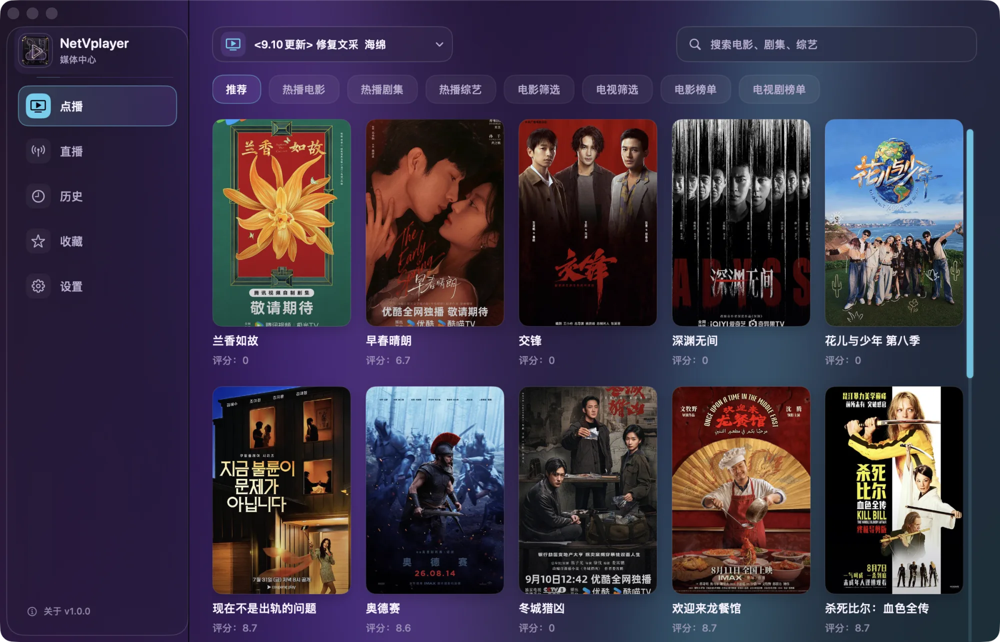
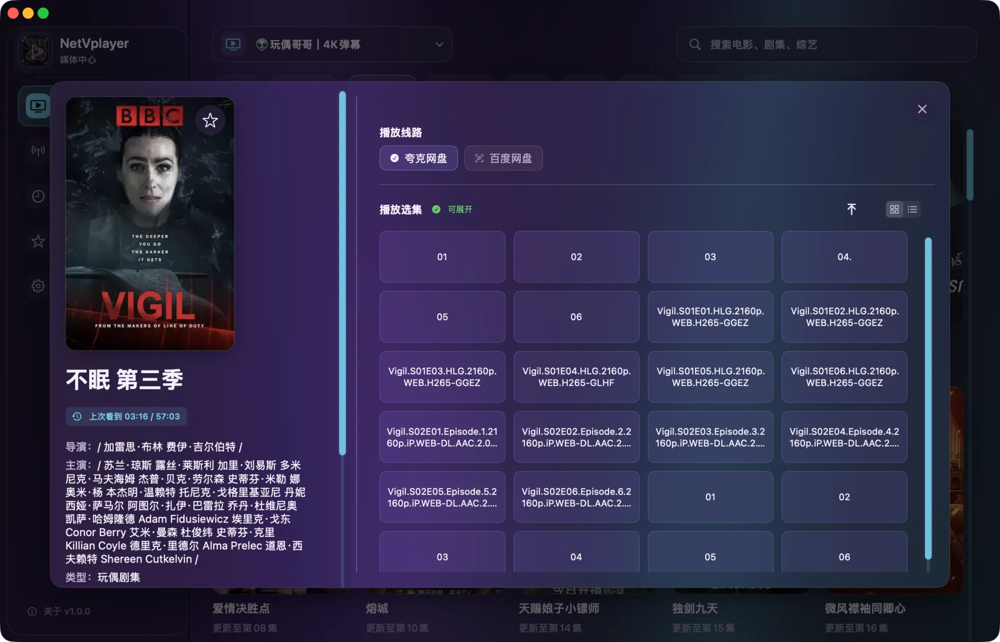
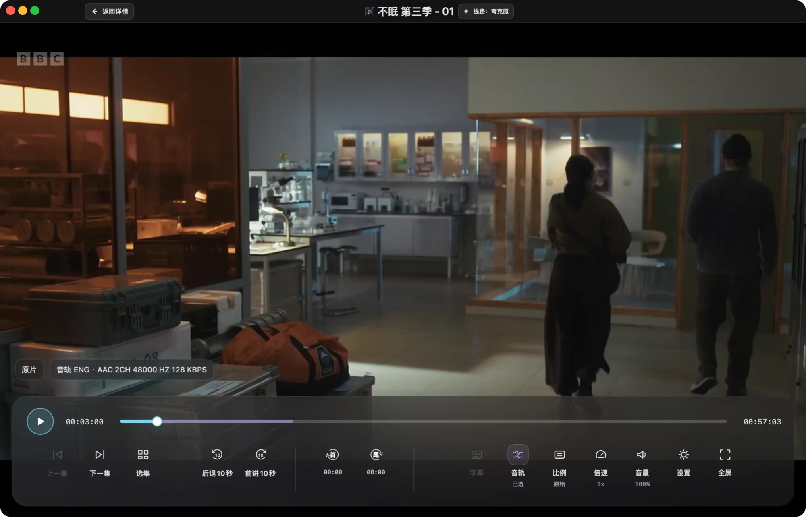

# NetVplayer

<p align="center">
  
</p>

<p align="center">
  <strong>你的内容，你的 Mac，你的播放方式。</strong><br>
  <strong>Your content. Your Mac. Your way to watch.</strong>
</p>

<p align="center">
  <a href="#中文">中文</a> |
  <a href="#english">English</a> |
  <a href="https://spudhero.github.io/NetVplayer/">Website</a> |
  <a href="https://github.com/spudhero/NetVplayer/releases/latest">Download</a> |
  <a href="CHANGELOG.md">Release History</a> |
  <a href="https://github.com/spudhero/NetVplayer-Provider-Distribution/releases">Provider Releases</a> |
  <a href="provider-sdk/README.md">Provider SDK</a>
</p>



当前正式版本 / Current release: **NetVplayer 2.0.3 (build 54)**。修复网页媒体接管与 Android 脚本兼容问题，两个实现严格隔离，Android 使用完整签名运行环境。见 [2.0.3 发布说明 / Release notes](docs/releases/2.0.3.md)。

上一正式版本 / Previous release: **NetVplayer 2.0.1 (build 52)**。来源实现隔离问题已在 2.0.2 修复，请升级 / Upgrade to 2.0.2 for isolated source implementations.

| Component | Version |
| --- | --- |
| Stable application | 2.0.3 (build 54) |
| Python Provider | 1.1.13 |
| Complete Android runtime | 1.2.4 |
| Legacy Android installer | 1.1.0 (historical compatibility) |

## 中文

NetVplayer 是基于 SwiftUI 与内嵌 libmpv 的原生 macOS 媒体播放器，支持点播、直播、云盘和自有文件。适用于 **macOS 14+ / Apple Silicon**，界面支持简体中文和 English。

公开应用不内置视频源、目录、直播列表、账号或媒体内容。内容入口由用户自行添加，并应具有相应访问权限。

### 项目背景

FongMi/TV、OK影视、影视仓、TVBox 等工具主要服务 Android 生态。我一直没有找到符合自己使用习惯的 macOS 版本，于是从 SwiftUI 与 libmpv 开始，写了 NetVplayer。

项目将内容浏览、搜索、选集和播放组织成原生 Mac 桌面体验。感谢 [FongMi/TV](https://github.com/FongMi/TV) 等开源实践提供的兼容性参考；NetVplayer 使用独立的 Swift/macOS 实现，与这些项目没有隶属或官方合作关系。

### 主要功能

支持直接添加夸克、UC、阿里、百度、115 的个人网盘目录，复用海报、详情和原片播放。真实账号验收待完成，见[使用与验证](docs/releases/2.0.0.md)。

2.0 新增 Plex、FTP／SFTP，并补齐 WebDAV、Alist、OpenList 的应用内实测；范围与限制见[发布说明](docs/releases/2.0.0.md)。

极影视／飞牛影视接入也已实现，并完成独立模拟 HTTP 与原生播放验证；真实 NAS 和完整播放窗口截图仍待验。见[发布说明与限制](docs/releases/2.0.0.md)。

- **浏览与搜索**：影片详情、多线路选集、跨已连接来源搜索。
- **点播与直播**：字幕、音轨、倍速、画面比例、章节预览、频道分组与节目单。
- **云盘与文件**：连接受支持云盘、WebDAV、AList/OpenList、SMB 和本机文件夹。
- **媒体库**：电影、剧集和混合海报墙，支持本地资料、TMDB、豆瓣及手动匹配。
- **桌面体验**：播放历史、收藏、续播、紧凑窗口与主题切换。

| 影片详情与选集 | 播放控制 |
| :---: | :---: |
|  |  |

### 安装

1. 从[最新 GitHub Release](https://github.com/spudhero/NetVplayer/releases/latest)下载 `macos-arm64.zip`。
2. 解压，将 `NetVplayer.app` 拖入“应用程序”。
3. 首次启动在 Finder 中右键选择“打开”。当前应用使用社区 ad-hoc 签名；如仍被拦截，在“系统设置 → 隐私与安全性”确认应用后选择“仍要打开”。
4. 等待“设置 → 扩展支持”显示就绪。首次安装和扩展更新需要能访问 GitHub。
5. 在“设置 → 内容来源”添加自己的配置、账号或文件位置，即可开始使用。

应用会在侧栏和设置页的版本号旁提示更新，确认后在后台下载与校验，正常退出后安装。版本说明与历史请查看 [CHANGELOG](CHANGELOG.md#中文)、[按版本发布说明](docs/releases/README.md)或 [GitHub Releases](https://github.com/spudhero/NetVplayer/releases)。

### 使用

- **在线内容**：在“设置 → 内容来源 → 在线内容”加载影视配置或 JSON、M3U、TXT 直播列表；Xtream 服务填写服务方提供的地址和账号。
- **云盘**：在“网盘账号”完成所需授权，再打开自己的文件或分享。
- **NAS / 本地**：在“视频文件位置”添加服务器或文件夹，测试并保存后从首页选择该服务；切到“媒体库”可添加电影或剧集目录。
- **播放**：打开详情选择线路和剧集，在播放器调整字幕、音轨和倍速；历史记录可继续上次播放。

TMDB 由正式应用提供项目凭据，普通用户无需填写令牌。配置与账号保存在本机，导出备份不包含密码、Token 或 Cookie。

### 扩展与开发

兼容的签名 Provider 由应用自动下载、验证和更新，异常时在“设置 → 扩展支持”选择“重新检查”。包版本与兼容说明见 [Provider Releases](https://github.com/spudhero/NetVplayer-Provider-Distribution/releases)。主程序和 SDK 公开，站点业务 Provider 实现源码保持私有。

Android 通用 Java／JNI 桥接、兼容层和构建实现已获准公开，连同固定上游对应源码、构建说明和许可证作为[完整 Android 环境的源码附件](https://github.com/spudhero/NetVplayer-Provider-Distribution/releases/tag/android-original-runtime-v1.2.4-arm64)提供；站点业务 Provider 实现继续私有。选择 Mac 实现不会准备 Android 环境；明确选择 Android 原版并重启后，首次只下载、验证和激活完整签名环境，JVM、框架和宿主不再在客户端分别下载组装。来源 JAR 仍按用户配置下载，不包含在应用或环境包中。完整环境使用独立 `android/runtime/index.json`，旧 `android/index.json` 保留历史兼容。公开播放器中的兼容规则资源是固定摘要生成物。

使用 Xcode 和 Homebrew libmpv 依赖从源码构建：

```bash
swift build --package-path NetVplayer
swift test --package-path NetVplayer --disable-sandbox --no-parallel
```

详细说明：[架构](ARCHITECTURE.md) · [Provider SDK](provider-sdk/README.md) · [Runner](provider-runners/README.md) · [打包凭据配置](TMDB_SETUP.md) · [贡献指南](CONTRIBUTING.md) · [安全说明](SECURITY.md)。

遇到问题可通过应用内“问题反馈”生成脱敏信息，并说明复现步骤。自动诊断可在“设置 → 问题反馈”中关闭。项目采用 [MIT License](LICENSE)，第三方组件适用各自许可证。

---

## English

NetVplayer is a native macOS media player built with SwiftUI and embedded libmpv, supporting on-demand video, live channels, cloud drives, and your own files. It runs on **macOS 14+ / Apple Silicon**, with Simplified Chinese and English interfaces.

The public app contains no bundled content sources, catalogs, channel lists, accounts, or media. Users add their own entry points and must be authorized to access them.

### Project background

FongMi/TV, OK影视, 影视仓, and TVBox primarily serve Android. I could not find a macOS version that matched how I wanted to use a desktop media app, so I started NetVplayer with SwiftUI and libmpv.

The project brings browsing, search, episode selection, and playback into a native Mac experience. Thanks to [FongMi/TV](https://github.com/FongMi/TV) and other open-source projects for compatibility references. NetVplayer uses an independent Swift/macOS implementation and has no affiliation or official partnership with those projects.

### Features

The app supports adding personal folders from Quark, UC, Aliyun, Baidu, and 115 to the existing poster library, details, and original-file playback. Real-account acceptance is pending; see the [usage and validation notes](docs/releases/2.0.0.md).

Version 2.0 adds Plex, FTP, and SFTP, with native-app acceptance evidence for WebDAV, Alist, and OpenList. See the [release notes](docs/releases/2.0.0.md) for scope and limitations.

Zspace Media and FnOS Media integration is implemented and verified with independent synthetic HTTP services and native playback. Real NAS acceptance and complete playback-window screenshots remain pending; see the [release notes and limitations](docs/releases/2.0.0.md).

- **Browse and search:** details, multiple playback routes, episode selection, and search across connected sources.
- **Video and live TV:** subtitles, audio tracks, playback speed, aspect ratio, chapter previews, channel groups, and programme guides.
- **Cloud drives and files:** supported drive accounts, WebDAV, AList/OpenList, SMB, and local folders.
- **Media libraries:** movie, TV, and mixed poster libraries with local metadata, TMDB, Douban, and manual matching.
- **Desktop controls:** history, favorites, resume playback, compact windows, and themes.

### Installation

1. Download `macos-arm64.zip` from the [latest GitHub Release](https://github.com/spudhero/NetVplayer/releases/latest).
2. Extract it and move `NetVplayer.app` to Applications.
3. On first launch, right-click the app in Finder and choose Open. The community build uses ad-hoc signing; if macOS blocks it, confirm the app under System Settings → Privacy & Security and choose Open Anyway.
4. Wait for Settings → Verified Extensions to report ready. Initial preparation and extension updates require access to GitHub.
5. Add your own configuration, accounts, or file locations under Settings → Content Sources.

The app marks available updates beside its version in the sidebar and Settings. Confirm an update to download and verify it in the background; installation happens on normal exit. See the [CHANGELOG](CHANGELOG.md#english), [versioned release notes](docs/releases/README.md), and [GitHub Releases](https://github.com/spudhero/NetVplayer/releases) for release history.

### Usage

- **Online content:** load a video configuration or JSON, M3U, or TXT channel list under Settings → Content Sources → Online Content. For Xtream services, enter the address and account supplied by your service.
- **Cloud drives:** authorize the required account under Cloud Drive Accounts, then open your files or shares.
- **NAS / local:** add a server or folder under Video File Locations, test and save it, then select it from the home source menu. Switch to Media Libraries to add movie or TV directories.
- **Playback:** choose a route and episode in the details view, adjust subtitles, audio, and speed in the player, and resume from History.

Official builds supply the TMDB application credential; ordinary users do not need a token. Configurations and accounts stay on the Mac. Exported backups exclude passwords, tokens, and cookies.

### Extensions and development

The app automatically downloads, verifies, and updates compatible signed Providers. Use Settings → Verified Extensions → Check Again if preparation fails. See [Provider Releases](https://github.com/spudhero/NetVplayer-Provider-Distribution/releases) for versions and compatibility. The main application and SDK are public; business Provider implementation sources remain private.

Generic Android Java/JNI bridge, compatibility and build sources are public as [complete-runtime source attachments](https://github.com/spudhero/NetVplayer-Provider-Distribution/releases/tag/android-original-runtime-v1.2.4-arm64), together with fixed upstream sources, build instructions and licenses. Business Provider implementations remain private. Mac mode does not prepare Android. After explicitly selecting original Android and restarting, the app downloads and verifies a complete signed environment, without assembling JVM/framework/host dependencies on the client. Source JARs still come from user configuration and are excluded from the app and runtime. Complete runtimes use the independent `android/runtime/index.json`; the legacy `android/index.json` is preserved. The player compatibility resource remains a pinned generated artifact.

Build from source with Xcode and the Homebrew libmpv dependencies using the commands above. Further documentation: [Architecture](ARCHITECTURE.md) · [Provider SDK](provider-sdk/README.md) · [Runners](provider-runners/README.md) · [Packaging credentials](TMDB_SETUP.md) · [Contributing](CONTRIBUTING.md) · [Security](SECURITY.md).

Use the in-app Problem Report flow to generate redacted diagnostics and describe reproduction steps. Automatic Diagnostics can be disabled under Settings → Problem Report. The project uses the [MIT License](LICENSE); third-party components retain their own licenses.
